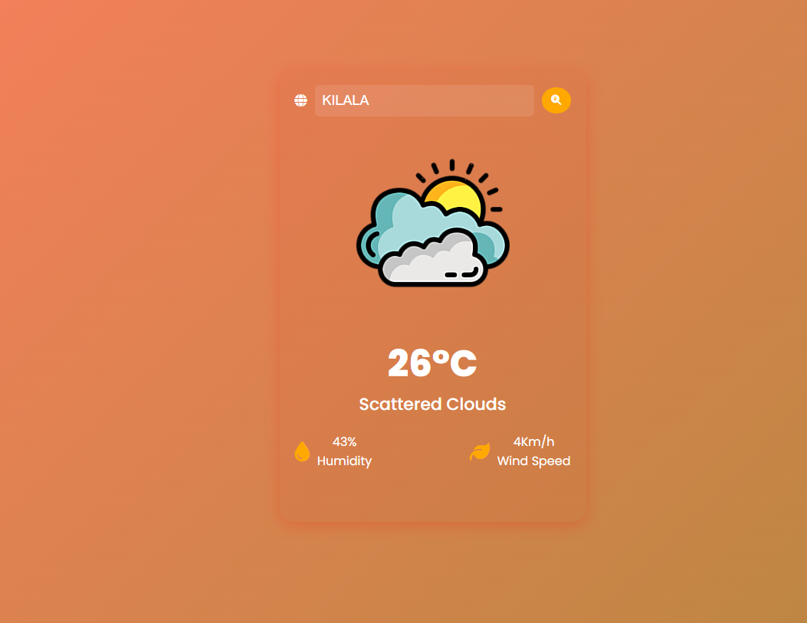

# NebulaWhisper 🌦️

A user-friendly weather app that provides real-time weather information for your desired location.

## Description 📝

The Weather App is designed to give users quick access to accurate weather details. It offers an intuitive interface, displaying key information such as current temperature, weather description, humidity, and wind speed.

## Features ✨

- **Easy Search**: Simply input your desired location to get instant weather updates.
- **Comprehensive Details**: View real-time temperature, weather description, humidity, and wind speed.
- **Responsive Design**: Enjoy a seamless experience across devices with our futuristic and responsive layout.

## Screenshots 📸

## Technologies Used 🛠️

- HTML
- CSS
- JavaScript
- OpenWeatherMap API
